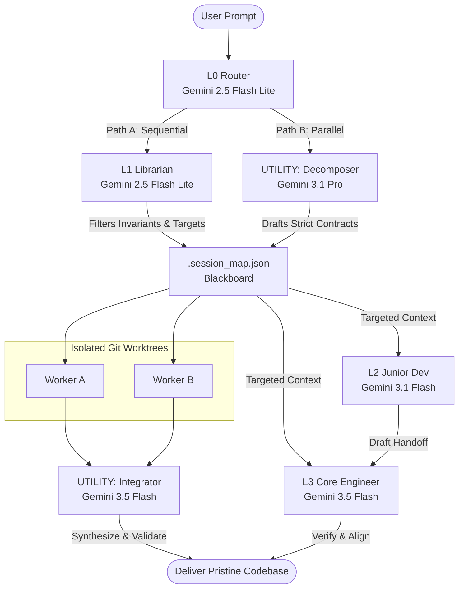

# AGY Cortex

[](https://github.com)
[](https://github.com)
[](https://github.com)
[](LICENSE)

**Transform single-agent context latency into a highly synchronized, tiered orchestrator of specialist subagents.**

`agy-cortex` is a sophisticated, globally installable plugin for the **Antigravity (AGY) CLI**. It replaces the monolithic "do-it-all" agent approach with a **Hub-and-Spoke Tiered Intelligence Model**—dynamically routing your prompts to specific specialist subagents. By dividing discovery, execution, planning, and review, the plugin maximizes reasoning depth while achieving unprecedented efficiency.

---

## Why AGY Cortex?

Standard AI developer agents suffer from **Context fatigue** and **Short-Term Amnesia**—ingesting massive codebase trees, terminal logs, and system rules on every prompt. This bloats costs, triggers hallucinations, and slows down conversational turns.

`agy-cortex` completely redefines multi-agent efficiency:

*   **70% to 90% Token Reduction**: Bypasses directory-wide scans and history-heavy prompts using a lightweight shared-memory blackboard.
*   **75% Lower Latency**: Triage is handled in milliseconds by an L0 Flash Router, executing code using targeted execution workers.
*   **Hallucination Protection**: Isolated specialized prompts prevent the model from getting lost in large file trees.
*   **Git-Isolated Parallelism**: Spawns concurrent execution branches simultaneously in isolated git worktrees, merging and validating code with zero collision risk.

---

## The 5-Tier Architecture

Prompt routing is managed automatically by the Orchestrator. When you submit a request, it is parsed and dispatched to the optimal tier in the intelligence loop:



---

## Core Pillars

### 1. Tiered Hub-and-Spoke Intelligence
Each subagent has a dedicated profile and is restricted to a narrow, optimized system prompt.
*   **L0 Router** (`Gemini 2.5 Flash Lite`): Fast, low-cost triage dispatching.
*   **L1 Librarian** (`Gemini 2.5 Flash Lite`): Codebase cataloging and summarization.
*   **L2 Junior Developer** (`Gemini 3.1 Flash`): Rapid boilerplate drafting and syntax checking.
*   **L3 Core Engineer** (`Gemini 3.5 Flash`): Full feature implementations and test suite verification.
*   **L4 Senior Developer** (`Gemini 3.1 Pro`): Refactoring, strategic debugging, and automatic ADR curation.
*   **L5 Lead Architect** (`Gemini 3.5 Pro`): High-level system design, strategic pivots, and invariants owner.

### 2. Two-Tiered Shared Memory
*   **Tier 1 (Master Focal Registry & ADRs)**: Active tasks are registered in a lean `CONTEXT.md`. Completed tasks are automatically converted into independent Architectural Decision Records (ADRs) under `.antigravitycli/adr/agy-cortex/` to prevent long-term context growth.
*   **Tier 2 (Active Session Blackboard)**: A temporary runtime `.session_map.json` blackboard is generated on the fly. Subagents boot up and read strictly from this blackboard, bypassing expensive codebase scans.

### 3. The Draft-then-Verify Pipeline
L2 (Junior Dev) performs high-volume drafting (mock systems, DB migrations, scaffolds) and runs local compiler checks. Once successfully drafted, the Orchestrator triggers L3 (Core Engineer) to run deep test suites and integration verifications—guaranteeing both speed and code correctness.

### 4. Isolated Parallel Execution (ADR-005)
For complex multi-layered tasks, `agy-cortex` enables an experimental concurrent workflow:
1.  **Planning**: Spawns **Decomposer** (`Gemini 3.1 Pro`) to graph dependencies and write API contracts.
2.  **User-in-the-Loop Gate**: Halts execution, presents the proposed plan, and awaits your explicit approval.
3.  **Concurrent Execution**: Spawns workers concurrently in isolated git worktrees (`share` workspace mode).
4.  **Merging & Verification**: Spawns **Integrator** (`Gemini 3.5 Flash`) to checkout, resolve merge conflicts, and execute test sweeps.

---

## Operational Slash Commands

To complement fully automated routing, `agy-cortex` exposes high-signal slash commands directly in the Antigravity TUI:

*   **`/toggle-routing`**: Toggle the core multi-agent triage and routing pipeline. When bypassed (`[BYPASSED]`), the main agent handles prompt resolution directly.
*   **`/toggle-parallel`**: Toggle the experimental multi-branch parallel routing engine (concurrency in isolated git worktrees).
*   **`/cortex <tier> <prompt>`**: Manually invoke a specific specialist subagent directly, bypassing automatic triage.
    *   *Tiers*: `librarian` (L1), `junior` (L2), `engineer` (L3), `senior` (L4), `architect` (L5), `decomposer`, `integrator`.
    *   *Blackboard Safety*: Targeting execution workers (`junior` or `engineer`) automatically triggers L1 Blackboard building if `.session_map.json` is missing.
    *   *Strategy Shielding*: Targeting strategy tiers (`senior` or `architect`) automatically restricts all write privileges.
*   **`/analyze [path]`**: Spin up the **L1 Librarian** to index files, compile symbols, and build/persist `.session_map.json` under your designated path.
*   **`/review`**: Retrieve the workspace `git diff HEAD` and spawn a sandboxed **L4 Senior Developer** to perform a complete code quality audit.
*   **`/draft <prompt>`**: Trigger the **L2 Junior Developer** directly to generate templates or files, followed by an L3 test verification sweep.

---

## Operational Transparency

Every execution response is prepended with its corresponding agent's branding header, indicating model and tier details:

`>>> [L3 | ENGINEER | Gemini 3.5 Flash]`  
*Internal thinking logs and verbose tools are dynamically collapsed in the console terminal stream to maintain maximum readability.*

---

## Quick Start Guide

### Installation Requirements
*   **AGY CLI** installed on your system.
*   **Python 3.x** (required to execute the visual branding hooks).

### Installation Steps

1.  **Clone the Repository**:
    ```bash
    git clone https://github.com/dsazykin/AGY-Cortex.git agy-cortex
    ```
2.  **Validate Plugin Structure**:
    ```bash
    agy plugin validate ./agy-cortex
    ```
3.  **Install Globally via AGY CLI**:
    ```bash
    agy plugin install ./agy-cortex --global
    ```
4.  **Verify Setup**:
    ```bash
    agy plugin list
    ```

Submit your development prompts normally, and the tiered orchestration engine will automatically coordinate your specialist team!

## Documentation Index

To discover more about the inner workings, refer to the resources below:

*   **[Technical Deep-Dive](./TECHNICAL_README.md)**: Deep dive into agent profiles, system prompts, blackboard specifications, parallel branching git mechanics, and quantitative token-savings analysis.